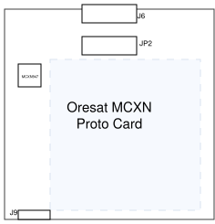

# Oresat Template App

### Overview
OreSat firmware project template using Zephyr RTOS.

This template demonstrates the use of the following hardware modules:
- Blink an LED forever using the GPIO API.
- Periodically read and display temperature, humidity, and barometric pressure using an I2C bus connected to a Bosch Sensortec BME-280 sensor, using the sensor API.
- Generate a continuous 16-bit sawtooth waveform on a DAC output pin using the DAC driver API.
- Periodically monitor two 12-bit ADC channels and display the samples, using the ADC driver API.
- Accept and process CAN-initiated firmware updates. See the `flash_canopen.py` script.

*If no BME-280 is connected, the I2C demo will fail. The initial address transaction is still visible on an oscilloscope.*

---
## Hardware

### Supported Boards

Supported boards contain Devicetree overlays in `boards/`. These overlays contain the `oresat_demo` label, which enables the demos in `Kconfig`. If a board does not have an overlay with the label, it will only log the messages found in `src/main.c`. Current supported boards are:
- FRDM-MCXN947
    - SCL:           J7.8
    - SDA:           J7.6
    - DAC:           J1.4
    - ADC channel 0: J4.8
    - ADC channel 1: J4.12
- NUCLEO-R091RC
    - SDA:      Arduino.D14  Morpho.PB9
    - SCL:      Arduino.D15  Morpho.PB8
    - DAC:      Arduino.A2   Morpho.PA4
    - ADC1_IN0: Arduino.A0   Morpho.PA0
    - ADC1_IN1: Arduino.A1   Morpho.PA1
- Oresat mcxn947_protocard
    - SCL:           TP77
    - SDA:           TP76
    - DAC:           TP28
    - ADC channel 0: TP30 (connects to MAX4211 Iout measurement; Iout = Vsense / Rsense; Rsense = 0.1 ohms)
    - ADC channel 1: TP44
    - ADC channel 26A/B: internal temperature; disabled currently in device tree
- Oresat mcxn947 breakout

### Wiring Example


- Connectors
  - J6 - main Oresat card connector; plugs into backplane
  - J9 - connector to Oresat Card Debug Board
  - JP2 - alternate footprint for J6 with easily solderable plated-through holes

---
## Firmware

In addition to the list in the overview above, it demonstrates:
- Using Kconfig values to control which C source files are included in a build.
- Zephyr logging of error messages, informational messages, and debug messages.
- Setting desired log level on a per-module basis.
- Using printk to display output whether logging is enabled or not.
- Threads.

The sample's `main.c` does very little. In fact, all it does is log a message.
Everything else is done in any of the enabled threads.

### Controlling which demo threads are enabled in the build
By default, all 6 threads are enabled, because the source files for them,
`blink.c`, `i2c_sensor.c`, `dac.c`, `adc.c`, `can.c`, and `gpio.c` are included in the build.
This is done using the file `Kconfig` and the file `CMakeLists.txt`.
The build options can be overriden by the `prj.conf` file or the build command line.

First, the `Kconfig` file defines symbols for each demo. For example:

```
config BLINK_DEMO
    bool "Blink an LED"
    default y
    help
      Enable the thread which blinks an LED.
```

Note the `default y`. If this line is missing, `default n` is implied.

This affects what is included in the build through conditional compilation
in CMakeLists.txt:

```
# Compile in various demos depending on Kconfig values.
target_sources_ifdef(CONFIG_BLINK_DEMO      app PRIVATE src/blink.c)
target_sources_ifdef(CONFIG_I2C_SENSOR_DEMO app PRIVATE src/i2c_sensor.c)
target_sources_ifdef(CONFIG_DAC_DEMO        app PRIVATE src/dac.c)
target_sources_ifdef(CONFIG_ADC_DEMO        app PRIVATE src/adc.c)
target_sources_ifdef(CONFIG_CAN_DEMO        app PRIVATE src/can.c)
target_sources_ifdef(CONFIG_CAN_DEMO        app PRIVATE objdict/CO_OD.c)
target_sources_ifdef(CONFIG_GPIO_DEMO       app PRIVATE src/gpio.c)
```
Note 1: in `Kconfig` files, the prefix `CONFIG_` is assumed, but not elsewhere.
Note 2: `CONFIG_` symbols are automatically defined in your build folder in
`build/zephyr/include/generated/zephyr/`.

In order to disable a specific demo, the recommended way is via the `prj.conf`
file. This file allows you to set Kconfig symbols to specific values. So to
disable the blink demo, add this line:

```
CONFIG_BLINK_DEMO=n
```

It may be tempting to modify the Kconfig instead to disable demos, or to make
other changes. This should only be done when deciding to make a change that
is the default behavior, rather than a temporary change that can be freely adjusted
later.

### The sample blinks an LED forever using the `GPIO API`

The source code in `blink.c` shows how to:

1. Get a pin specification from the [devicetree](https://docs.zephyrproject.org/latest/build/dts/index.html#dt-guide) as a `gpio_dt_spec`
2. Configure the GPIO pin as an output
3. Toggle the pin forever

See the Zephyr [pwm-blinky](https://docs.zephyrproject.org/latest/samples/basic/blinky_pwm/README.html#pwm-blinky)
sample for a similar sample that uses the `PWM API` instead.

### The sample periodically samples an I2C sensor

The source code in `i2c_sensor.c` shows how to:

1. Connect to a sensor
2. Read a block of samples from it
3. Use a sensor decoder API to decode specific sensor channels

### The sample periodically generates a waveform on a DAC

1. Connect to a DAC
2. Set up the DAC
3. Write waveform values to the DAC

Note: the time between samples generated is not particularly jitter-free.
When timing is critical because the frequency of the generated waveform
is high, other methods like:

 - using a hardware timer to generate interrupts and then update the DAC output
 from the interrupt handler
- generate buffers in RAM of sample data and use DMA to the DAC to automatically
 transfer the samples at a rate set by a hardware timer

### The sample periodically samples two ADC channels

1. Connect to the ADC and two channels within it
2. Setup each of the channels
3. Determine the reference voltage for each channel
4. Read a sequence of samples
5. Convert to millivolts based on the reference voltage

### The sample responds with CAN data when requested by the CAN controller

The source code in `can.c` and `CO_OD.c` show how to:

1. Initialize the Zephyr CANopenNode stack
2. Periodically make changes to CAN data in a safe manner
3. Process CAN inputs, outputs, and possible MCUboot firmware update requests
4. Handle bus resets

### The sample periodically logs the state of GPIO inputs

1. Initialize all entries in an array of GPIO structures containing the proper device tree reference, test point number, port number, and bit number
2. Periodically log the state of each GPIO

### Hardware connections

- NXP FRDM-MCXN947

- ST NUCLEO-R091RC

- Oresat MCXN Proto Card
  - LED and series current limit resistor are already stuffed on board
  - I2C SCL to `TP77`
  - I2C SDA to `TP76`
  - Two 4.7K pull up resistors to I2C SCL and I2C SDA are already stuffed on board
  - Connect I2C SCL to BME280 board SCK
  - Connect I2C SDA to BME280 board SDI
  - Connect the BME280 board Vin to Vbus on pin 1 of the CAN connector J3
  - Connect the BME280 board GND to breakout board GND
  - DAC output is from `TP28`
  - ADC0 channel 0 inputs from `TP30` which connects on board to the MAX4211 Iout measurement
  - ADC0 channel 1 inputs from `TP44`
  - Jumper the DAC to ADC0 channel 1

- Oresat MCXN Breakout
  - LED and series current limit resistor between `P1_13` and +3.3v
  - I2C SCL to `P0_17`
  - I2C SDA to `P0_16`
  - Connect two 4.7K pull up resistors to I2C SCL and I2C SDA; up = +3.3v
  - Connect I2C SCL to BME280 board SCK
  - Connect I2C SDA to BME280 board SDI
  - Connect the BME280 board Vin to Vbus on pin 1 of the CAN connector J3
  - Connect the BME280 board GND to breakout board GND
  - DAC output is from `P4_2`
  - ADC0 channel 1A inputs from `P4_15`
  - ADC0 channel 2A inputs from `P4_23`
  - Jumper the DAC to ADC0 channel 1A
  - Jumper GND or +3.3v to ADC0 channel 2A

### Building and Running
Ensure you are in the `template` directory (`cd src/oresat/firmware/apps/template`) prior to building.

| Board         | Build Example                                          |
| ------------- | ----------------------------------------------------- |
| FRDM-MCXN947  | `west build -p always -b frdm_mcxn947/mcxn947/cpu0 -- -DCONFIG_MCUBOOT_ALLOWED=n` |
| FRDM-MCXN947 with MCUboot  | `west build -p always -b frdm_mcxn947/mcxn947/cpu0 --sysbuild` |
| NUCLEO-R091RC | `west build -p always -b nucleo_f091rc`             |
| mcxn947_protocard | `west build -p always -b mcxn947_protocard/mcxn947/cpu0 -- -DCONFIG_MCUBOOT_ALLOWED=n` |
| mcxn947_protocard with MCUboot | `west build -p always -b mcxn947_protocard/mcxn947/cpu0 --sysbuild -- -DBOARD_ROOT=$PWD` |

#### Flashing

Flashing is done via [probe-rs](probe.rs). Follow their [installation instructions](https://probe.rs/docs/getting-started/installation/).
Once installed, follow their [probe setup instructions](https://probe.rs/docs/getting-started/probe-setup/).

If you have previously installed probe-rs and are on an old version (v<0.32), make sure you follow their uninstalling procedure and use their most up-to-date release.

Flash the build using `west flash`.

To fully erase before flashing, do `west flash --erase`

Note: the CMakeLists.txt file sets the `BOARD_ROOT` so that it does not
need to be specified on the command line.

### Logging

Logging is outputted over UART and [RTT](https://www.segger.com/products/debug-probes/j-link/technology/about-real-time-transfer/).

To see RTT output run `west rtt`

After running the above command for the blinky app you should see the following output:

```bash
(.venv) <oresat-zephyr> ~/src/oresat/firmware/apps/template % west rtt
-- west rtt: rebuilding
ninja: no work to do.
-- west rtt: using runner probe-rs
-- runners.probe-rs: reset after flashing requested
-- runners.probe-rs: Starting RTT session
 WARN probe_rs::rtt: Buffer for up channel 1 not initialized
 WARN probe_rs::rtt: Buffer for up channel 2 not initialized
 WARN probe_rs::rtt: Buffer for down channel 1 not initialized
 WARN probe_rs::rtt: Buffer for down channel 2 not initialized
[00:00:00.000,000] <dbg> can_mcux_flexcan: mcux_flexcan_init: Message Buffers: 32, RX MB: 13, TX MB: 19
17:32:08.144: [00:00:00.009,000] <dbg> can_mcux_flexcan: mcux_flexcan_init: Presc: 3, Seg1S1: 6, Seg2: 4
17:32:08.144: [00:00:00.018,000] <dbg> can_mcux_flexcan: mcux_flexcan_init: Sample-point err : 0
17:32:08.144: [00:00:00.028,000] <dbg> BME280: bme280_chip_init: ID read failed: -5
17:32:08.144: *** Booting Zephyr OS build v4.4.1 ***
17:32:08.144: [00:00:00.039,000] <inf> oresat_zephyr_template: Oresat Template App
17:32:08.144: [00:00:00.045,000] <inf> oresat_zephyr_template:    Oresat   Board: mcxn947_protocard/mcxn947/cpu0
17:32:08.144: [00:00:00.055,000] <dbg> hwinfo_cmc: z_impl_hwinfo_get_reset_cause: sources = 0x00004214, cause = 0x00000026
17:32:08.144: [00:00:00.065,000] <dbg> hwinfo_cmc: z_impl_hwinfo_clear_reset_cause: sources = 0x00004214
17:32:08.144: [00:00:00.074,000] <inf> oresat_zephyr_template:     Chip     HWID:
[00:00:02.151,000] <dbg> oresat_blink_demo: handle_blink: The light is blinking! 7a 35  ca 50 e5 a5 90 29 57 4f |...w_=z5 .P...)WO
17:32:09.886: [00:00:03.158,000] <dbg> oresat_blink_demo: handle_blink: The light is blinking!
17:32:10.810: [00:00:04.166,000] <dbg> oresat_blink_demo: handle_blink: The light is blinking!
Terminal>
```

### Behavior

After flashing, the LED starts to blink and messages with the current LED state,
I2C sensor data, DAC cycles, and ADC samples are printed to the console.
If a runtime error occurs, `<err>` logs are generated.

### Example output with four demos enabled on Oresat Breakout

<details>
<summary>Click to expand</summary>


```
[00:00:00.004,000] <dbg> BME280: bme280_chip_init: ID OK
[00:00:00.014,000] <dbg> BME280: bme280_chip_init: "bme280@77" OK
*** Booting Zephyr OS build v4.2.0 ***

[00:00:00.014,000] <inf> oresat_mcxn947_demo: Oresat MCXN947 Breakout Board Demo
[00:00:00.014,000] <inf> oresat_zephyr_template: Oresat template starting on board: mcxn947_breakout/mcxn947/cpu0

[00:00:00.014,000] <inf> oresat_dac_demo: Starting DAC demo
[00:00:00.014,000] <dbg> oresat_dac_demo: handle_dac: Generating sawtooth signal at DAC channel 0.
[00:00:00.014,000] <dbg> oresat_dac_demo: handle_dac: Number of DAC samples per cycle: 4096, sleep time per sample (us): 100
[00:00:00.014,000] <inf> oresat_adc_demo: Starting ADC demo
[00:00:00.014,000] <inf> oresat_adc_demo: Channels: 2, sequence samples: 8, resolution: 12
[00:00:00.014,000] <inf> oresat_adc_demo: Channel: 0, vref_mv: 3300, gain: 9, acq time: 16386, diff: 0, inp_pos: 1, inp_neg: 0
[00:00:00.014,000] <inf> oresat_adc_demo: Channel: 1, vref_mv: 3300, gain: 9, acq time: 16386, diff: 0, inp_pos: 2, inp_neg: 0
[00:00:00.014,000] <inf> oresat_blink_demo: Starting blink demo
[00:00:00.014,000] <dbg> oresat_blink_demo: handle_blink: The light is blinking!
[00:00:00.014,000] <inf> oresat_i2c_sensor_demo: Starting I2C sensor demo
[00:00:00.014,000] <inf> oresat_i2c_sensor_demo: Found device "bme280@77", getting sensor data
temp: 25.509979; press: 101.703125; humidity: 45.500976
 413, 410, 414, 410, 412, 411, 412, 410,
   0,   0,   0,   0,   0,   0,   0,   0,
 817, 816, 820, 820, 818, 817, 817, 817,
   0,   0,   0,   0,   0,   0,   0,   0,
 1222, 1227, 1223, 1227, 1222, 1222, 1224, 1225,
   0,   0,   0,   0,   0,   0,   0,   0,
 1632, 1633, 1633, 1633, 1632, 1633, 1633, 1633,
   0,   0,   0,   0,   0,   0,   0,   0,
 2042, 2041, 2039, 2042, 2042, 2042, 2042, 2042,
   0,   0,   0,   0,   0,   0,   0,   0,
 2448, 2448, 2450, 2450, 2448, 2451, 2447, 2448,
   0,   0,   0,   0,   0,   0,   0,   0,
 2854, 2853, 2853, 2854, 2857, 2854, 2854, 2856,
   0,   0,   0,   0,   0,   0,   0,   0,
 3262, 3262, 3259, 3262, 3262, 3259, 3259, 3262,
   0,   0,   0,   0,   0,   0,   0,   0,
[00:00:00.834,000] <inf> oresat_dac_demo: Cycle 1
 349, 348, 344, 346, 344, 347, 348, 347,
   0,   0,   0,   0,   0,   0,   0,   0,
[00:00:01.014,000] <dbg> oresat_blink_demo: handle_blink: The light is blinking!
 754, 750, 754, 751, 755, 752, 754, 750,
   0,   0,   0,   0,   0,   0,   0,   0,
 1159, 1160, 1159, 1159, 1161, 1159, 1160, 1159,
   0,   0,   0,   0,   0,   0,   0,   0,
```
</details>

### Example output with all demos enabled on Oresat MCXN Proto Card

<details>
<summary>Click to expand</summary>

```
*** Booting MCUboot v2.2.0-54-g4eba8087fa60 ***
*** Using Zephyr OS build v4.2.0 ***
[0:0:0.7,0] <inf> mcuboot: Starting bootloader
[0:0:0.12,0] <inf> mcuboot: Primary image: magic=good, swap_type=0x2, copy_done=0x1, image_ok=0x1
[0:0:0.21,0] <inf> mcuboot: Secondary image: magic=unset, swap_type=0x1, copy_done=0x3, image_ok=0x3
[0:0:0.31,0] <inf> mcuboot: Boot source: none
[0:0:0.35,0] <inf> mcuboot: Image index: 0, Swap type: none
[0:0:0.106,0] <inf> mcuboot: Bootloader chainload address offset: 0x14000
[0:0:0.113,0] <inf> mcuboot: Image version: v0.0.0
[0:0:0.118,0] <inf> mcuboot: Jumping to the first image slot
[00:00:00.002,000] <dbg> can_mcux_flexcan: mcux_flexcan_init: Presc: 3, Seg1S1: 6, Seg2: 4
[00:00:00.010,000] <dbg> can_mcux_flexcan: mcux_flexcan_init: Sample-point err : 0
[00:00:00.020,000] <dbg> BME280: bme280_chip_init: ID read failed: -5
*** Booting Zephyr OS build v4.2.0 ***
[00:00:00.031,000] <inf> oresat_zephyr_template: Oresat template starting on board: mcxn947_protocard/mcxn947/cpu0
[00:00:00.041,000] <inf> can_thread: Starting CAN thread
[00:00:00.047,000] <inf> can_thread: Firmware already confirmed.
[00:00:00.053,000] <dbg> can_thread: handle_can: Opening CAN device
[00:00:00.060,000] <inf> can_thread: Starting CANopenNode (node_id=124, bitrate=1000 kbps)
[00:00:00.069,000] <dbg> canopen_driver: CO_CANmodule_init: rxSize = 12, txSize = 13
[00:00:00.077,000] <dbg> canopen_driver: CO_CANmodule_init: excessive number of concurrent CAN RX filters enabled (needs 12, 13 available)
TPDO valid: 0x40000180, ID: 0x000001fc, nodeId: 0x007c, default COB_ID: 0x00000180
TPDO valid: 0x40000280, ID: 0x000002fc, nodeId: 0x007c, default COB_ID: 0x00000280
TPDO valid: 0x40000380, ID: 0x000003fc, nodeId: 0x007c, default COB_ID: 0x00000380
TPDO valid: 0x40000480, ID: 0x000004fc, nodeId: 0x007c, default COB_ID: 0x00000480
TPDO valid: 0x40000181, ID: 0x000001fd, nodeId: 0x007c, default COB_ID: 0x00000000
TPDO valid: 0x40000281, ID: 0x000002fd, nodeId: 0x007c, default COB_ID: 0x00000000
TPDO valid: 0x40000381, ID: 0x000003fd, nodeId: 0x007c, default COB_ID: 0x00000000
TPDO valid: 0x40000481, ID: 0x000004fd, nodeId: 0x007c, default COB_ID: 0x00000000
TPDO valid: 0x40000182, ID: 0x000001fe, nodeId: 0x007c, default COB_ID: 0x00000000
TPDO valid: 0x40000282, ID: 0x000002fe, nodeId: 0x007c, default COB_ID: 0x00000000
[00:00:00.163,000] <inf> can_thread: Template app running. Waiting for CANopen requests...
[00:00:00.171,000] <inf> oresat_dac_demo: Starting DAC demo
[00:00:00.177,000] <dbg> oresat_dac_demo: handle_dac: Generating sawtooth signal at DAC channel 0.
[00:00:00.187,000] <dbg> oresat_dac_demo: handle_dac: Number of DAC samples per cycle: 4096, sleep time per sample (us): 100
[00:00:00.198,000] <inf> oresat_gpio_demo: Starting GPIO demo
[00:00:00.204,000] <inf> oresat_gpio_demo: TP84 P0_3 = 1
[00:00:00.210,000] <inf> oresat_gpio_demo: TP85 P0_4 = 0
[00:00:00.216,000] <inf> oresat_gpio_demo: TP86 P0_5 = 0
[00:00:00.221,000] <inf> oresat_gpio_demo: TP78 P0_18 = 0
[00:00:00.227,000] <inf> oresat_gpio_demo: TP79 P0_19 = 0
[00:00:00.233,000] <inf> oresat_gpio_demo: TP80 P0_20 = 0
[00:00:00.239,000] <inf> oresat_gpio_demo: TP81 P0_21 = 0
[00:00:00.245,000] <inf> oresat_gpio_demo: TP82 P0_22 = 0
[00:00:00.250,000] <inf> oresat_gpio_demo: TP83 P0_23 = 0
[00:00:00.256,000] <inf> oresat_gpio_demo: TP68 P1_0 = 0
[00:00:00.262,000] <inf> oresat_gpio_demo: TP69 P1_1 = 0
[00:00:00.268,000] <inf> oresat_gpio_demo: TP70 P1_2 = 0
[00:00:00.273,000] <inf> oresat_gpio_demo: TP71 P1_3 = 0
[00:00:00.279,000] <inf> oresat_gpio_demo: TP72 P1_4 = 0
[00:00:00.285,000] <inf> oresat_gpio_demo: TP73 P1_5 = 0
[00:00:00.290,000] <inf> oresat_gpio_demo: TP74 P1_6 = 0
[00:00:00.296,000] <inf> oresat_gpio_demo: TP75 P1_7 = 0
[00:00:00.302,000] <inf> oresat_gpio_demo: TP5 P1_12 = 0
[00:00:00.308,000] <inf> oresat_gpio_demo: TP7 P1_14 = 0
[00:00:00.313,000] <inf> oresat_gpio_demo: TP8 P1_15 = 0
[00:00:00.319,000] <inf> oresat_gpio_demo: TP9 P2_0 = 0
[00:00:00.325,000] <inf> oresat_gpio_demo: TP10 P2_1 = 0
[00:00:00.330,000] <inf> oresat_gpio_demo: TP52 P3_1 = 0
[00:00:00.336,000] <inf> oresat_gpio_demo: TP60 P3_12 = 0
[00:00:00.342,000] <inf> oresat_gpio_demo: TP59 P3_13 = 0
[00:00:00.348,000] <inf> oresat_gpio_demo: TP58 P3_14 = 0
[00:00:00.354,000] <inf> oresat_gpio_demo: TP57 P3_15 = 0
[00:00:00.359,000] <inf> oresat_gpio_demo: TP56 P3_16 = 0
[00:00:00.365,000] <inf> oresat_gpio_demo: TP55 P3_17 = 0
[00:00:00.371,000] <inf> oresat_gpio_demo: TP62 P3_20 = 0
[00:00:00.377,000] <inf> oresat_gpio_demo: TP63 P3_21 = 0
[00:00:00.383,000] <inf> oresat_gpio_demo: TP29 P4_1 = 0
[00:00:00.388,000] <inf> oresat_gpio_demo: TP27 P4_3 = 0
[00:00:00.394,000] <inf> oresat_gpio_demo: TP26 P4_4 = 0
[00:00:00.400,000] <inf> oresat_gpio_demo: TP25 P4_5 = 0
[00:00:00.405,000] <inf> oresat_gpio_demo: TP22 P4_6 = 0
[00:00:00.411,000] <inf> oresat_gpio_demo: TP20 P4_7 = 0
[00:00:00.417,000] <inf> oresat_gpio_demo: TP41 P4_19 = 0
[00:00:00.423,000] <inf> oresat_gpio_demo: TP64 P5_0 = 0
[00:00:00.428,000] <inf> oresat_gpio_demo: TP65 P5_1 = 0
[00:00:00.434,000] <inf> oresat_gpio_demo: TP66 P5_2 = 0
[00:00:00.440,000] <inf> oresat_gpio_demo: TP67 P5_3 = 0
[00:00:00.445,000] <inf> oresat_adc_demo: Starting ADC demo
[00:00:00.451,000] <inf> oresat_adc_demo: Channels: 2, sequence samples: 8, resolution: 12
[00:00:00.460,000] <inf> oresat_adc_demo: Channel: 0, vref_mv: 3300, gain: 9, acq time: 16386, diff: 0, inp_pos: 0, inp_neg: 0
[00:00:00.472,000] <inf> oresat_adc_demo: Channel: 1, vref_mv: 3300, gain: 9, acq time: 16386, diff: 0, inp_pos: 1, inp_neg: 0
[00:00:00.484,000] <inf> oresat_blink_demo: Starting blink demo
[00:00:00.490,000] <dbg> oresat_blink_demo: handle_blink: The light is blinking!
[00:00:00.498,000] <inf> oresat_i2c_sensor_demo: Starting I2C sensor demo
[00:00:00.505,000] <err> oresat_i2c_sensor_demo:
Error: Device "bme280@77" is not ready; check the driver initialization logs for errors.
[00:00:00.518,000] <err> oresat_i2c_sensor_demo: Could not find the BME280
Channel 0: 435, 348, 382, 609, 293, 336, 609, 246,
Channel 1: 815, 1227, 509, 584, 1021, 414, 538, 815,
Channel 0: 364, 712, 319, 336, 609, 264, 281, 506,
Channel 1: 815, 686, 1227, 506, 538, 1021, 407, 437,
Channel 0: 414, 767, 406, 297, 336, 609, 255, 281,
Channel 1: 1434, 686, 844, 1123, 464, 538, 815, 406,
Channel 0: 422, 437, 609, 319, 336, 609, 246, 281,
Channel 1: 1227, 815, 639, 1021, 464, 538, 712, 406,
Channel 0: 483, 537, 609, 308, 336, 609, 264, 281,
Channel 1: 1227, 612, 686, 1227, 468, 538, 815, 406,
Channel 0: 829, 448, 382, 336, 435, 609, 264, 281,
Channel 1: 790, 1227, 1227, 815, 464, 538, 1021, 406,
Channel 0: 686, 468, 437, 712, 319, 336, 609, 264,
Channel 1: 815, 1434, 609, 639, 1021, 448, 538, 815,
[00:00:01.264,000] <inf> oresat_dac_demo: Cycle 1
Channel 0: 382, 321, 336, 609, 273, 281, 506, 228,
Channel 1: 816, 1227, 509, 584, 1021, 409, 483, 609,
Channel 0: 336, 429, 406, 301, 609, 246, 281, 506,
Channel 1: 815, 639, 802, 609, 538, 815, 406, 437,
</details>
```

---
### Other Information

More information on the application and adding other boards can be found in [Oresat MCXN947 Demo], from which this template originated.

Please follow the installation steps in [Oresat Zephyr Setup].

[Oresat Zephyr Setup]:https://github.com/oresat/oresat-firmware/blob/zephyr/README.md
[Oresat MCXN947 Demo]:https://github.com/plskeggs/oresat-mcxn947-demo/blob/feature-demo-other-hardware/README.md

### Todo

- complete wiring diagram
- document breakout board connections
- add section about CAN data definitions
